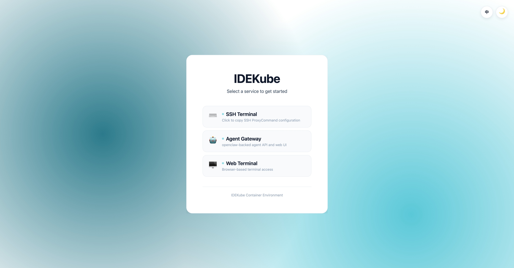
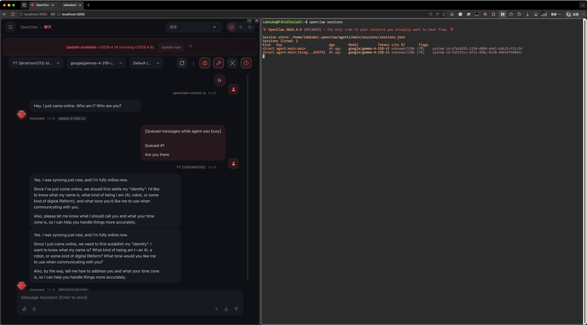

# idekube-container

<div style="text-align: center;">
    
</div>

The IDEKUBE project provides IDE containers for development work within Kubernetes clusters. This is a continuously updated collection of containers used in robotics, simulations, machine learning, and education (Shanghai Jiao Tong University Paris Elite Institute of Technology - SPEIT).

This is the **meta-repository** that ties together all sub-projects. Each component lives in its own repository for independent versioning and low-coupling maintenance.

## Repository Structure

### Tool Projects

| Submodule | Repository | Description |
|-----------|------------|-------------|
| [`docker-builder/`](docker-builder/) | [idekube-container-docker-builder](https://github.com/idekube-project/idekube-container-docker-builder) | Build orchestrator (`build.py`), CI templates, test framework |
| [`artifacts/`](artifacts/) | [idekube-container-artifacts](https://github.com/idekube-project/idekube-container-artifacts) | Shared install scripts and common rootfs overlay |
| [`frontend/`](frontend/) | [idekube-container-frontend](https://github.com/idekube-project/idekube-container-frontend) | Vue.js landing page (auto-detects services) |
| [`healthcheck/`](healthcheck/) | [idekube-container-healthcheck](https://github.com/idekube-project/idekube-container-healthcheck) | Go health check server (`/health` endpoint) |
| [`qemu-builder/`](qemu-builder/) | [idekube-container-qemu-builder](https://github.com/idekube-project/idekube-container-qemu-builder) | QEMU VM build tools and scripts |

### Image Projects (Base)

| Submodule | Repository | Images | Description |
|-----------|------------|--------|-------------|
| [`images/featured-base/`](images/featured-base/) | [idekube-container-featured-base](https://github.com/idekube-project/idekube-container-featured-base) | `featured/base` | Full desktop (XFCE + noVNC) + Coder + SSH + Miniconda + VirtualGL |
| [`images/coder-base/`](images/coder-base/) | [idekube-container-coder-base](https://github.com/idekube-project/idekube-container-coder-base) | `coder/base` | Coder IDE + SSH, minimal install |
| [`images/jupyter-base/`](images/jupyter-base/) | [idekube-container-jupyter-base](https://github.com/idekube-project/idekube-container-jupyter-base) | `jupyter/base` | JupyterLab + SSH + Miniconda |
| [`images/agent-base/`](images/agent-base/) | [idekube-container-agent-base](https://github.com/idekube-project/idekube-container-agent-base) | `agent/base` | AI agent toolchain (Claude Code + opencode + ttyd + document processing) |

### Image Projects (Derived)

| Submodule | Repository | Images | Base |
|-----------|------------|--------|------|
| [`images/featured/`](images/featured/) | [idekube-container-featured](https://github.com/idekube-project/idekube-container-featured) | `speit`, `speit-ai`, `dind`, `kathara`, `ros2` | `featured/base` |
| [`images/coder/`](images/coder/) | [idekube-container-coder](https://github.com/idekube-project/idekube-container-coder) | `conda` | `coder/base` |
| [`images/jupyter/`](images/jupyter/) | [idekube-container-jupyter](https://github.com/idekube-project/idekube-container-jupyter) | `speit-ai`, `speit-ascendai` | `jupyter/base` |
| [`images/agent/`](images/agent/) | [idekube-container-agent](https://github.com/idekube-project/idekube-container-agent) | `openclaw`, `hermes` | `agent/base` |

## Architecture

### Four Flavors

- **`featured/`** -- Full desktop with Coder + noVNC (TurboVNC + VirtualGL) + SSH. Variants: `base`, `speit`, `speit-ai`, `dind`, `kathara`, `ros2`
- **`coder/`** -- Coder IDE only + SSH. Variants: `base`, `conda`
- **`jupyter/`** -- JupyterLab only + SSH. Variants: `base`, `speit-ai`, `speit-ascendai`
- **`agent/`** -- AI agent toolchain (Claude Code + opencode + document processing) + ttyd web terminal + SSH. Variants: `base`, `openclaw`, `hermes`

### Service Endpoints

All services are reverse-proxied by Nginx on port 80:

| Endpoint | Service |
|----------|---------|
| `/` | Landing page (auto-detects available services) |
| `/coder` | Coder service |
| `/jupyter` | Jupyter service |
| `/vnc` | noVNC service |
| `/agent` | openclaw agent gateway |
| `/terminal` | ttyd web terminal |
| `/ssh` | Websocat-proxied SSH |
| `/health` | Health check endpoint (no auth, JSON, for k8s probes) |

### Build System

Each image project is self-contained with its own `config.json`, `.dockerargs`, and `Makefile`. The build orchestrator (`docker-builder/build.py`) scans `docker/*/images.json` sub-directories, resolves the dependency DAG, and automatically injects the correct `BASE_IMAGE` build-arg.

**Key design principles:**
- **Sub-directory driven**: Each image has its own `docker/<variant>/images.json` defining branch name and dependency
- **Stable tag**: Base projects publish a `stable` tag; derived projects `FROM` the stable tag by default
- **Independent versioning**: Each project tags and publishes independently
- **Shared artifacts**: Common install scripts and rootfs live in the `artifacts` repo, referenced via git submodule

```
# In any image project:
make prepare      # Init submodules, create symlinks
make build        # Build single image
make build-all    # Build all images (DAG order)
make discover     # Show discovered images and dependencies
make tag-stable   # Retag as stable after publishing
```

### Dependency Graph

```
featured/base ──> featured/speit
              ──> featured/speit-ai
              ──> featured/dind ──> featured/kathara
              ──> featured/ros2

coder/base ──> coder/conda

jupyter/base ──> jupyter/speit-ai
             ──> jupyter/speit-ascendai

agent/base ──> agent/openclaw
           ──> agent/hermes
```

Base images are built from `ubuntu:24.04` (or `ascendai/cann` for Ascend lineup). Derived images `FROM` their base's `stable` tag.

## Screenshots

<div style="text-align: center;">
    
</div>

<div style="text-align: center;">
    
</div>

## Quick Start

### Clone with submodules

```bash
git clone --recurse-submodules https://github.com/idekube-project/idekube-container.git
```

### Run a pre-built image

```yaml
# docker-compose.yml
services:
  idekube_container:
    image: davidliyutong/idekube-container:featured-base-stable
    ports:
      - "3000:80"
    volumes:
      - idekube_volume:/home/idekube
    deploy:
      resources:
        reservations:
          devices:
            - driver: nvidia
              count: 1
              capabilities: ["gpu"]
    ipc: host

volumes:
  idekube_volume:
    driver: local
```

### Build from source

```bash
cd images/featured-base
make prepare && make build
```

## Available Docker Image Tags

Pre-built images are published on [Docker Hub](https://hub.docker.com/r/davidliyutong/idekube-container).

### Standard Tags (base image: `ubuntu:24.04`)

| Tag | Flavor | Description | Base |
|-----|--------|-------------|------|
| `featured-base` | featured | Full desktop (XFCE + noVNC) + Coder + SSH + Miniconda + VirtualGL + Chromium | `ubuntu:24.04` |
| `featured-speit` | featured | `featured-base` + dev tools (gcc, clang, gdb, cmake) + Python scientific stack + Iverilog + Digital | `featured-base` |
| `featured-speit-ai` | featured | `featured-base` + dev tools + PyTorch conda environment | `featured-base` |
| `featured-dind` | featured | `featured-base` + Docker-in-Docker (dockerd, buildx, compose) | `featured-base` |
| `featured-kathara` | featured | `featured-dind` + Kathara network emulation | `featured-dind` |
| `featured-ros2` | featured | `featured-base` + ROS 2 Jazzy desktop-full + Gazebo + MoveIt | `featured-base` |
| `coder-base` | coder | Coder IDE + SSH, minimal install | `ubuntu:24.04` |
| `coder-conda` | coder | `coder-base` + Miniconda | `coder-base` |
| `jupyter-base` | jupyter | JupyterLab + SSH + Miniconda | `ubuntu:24.04` |
| `jupyter-speit-ai` | jupyter | `jupyter-base` + scientific stack + PyTorch conda environment | `jupyter-base` |
| `agent-base` | agent | Claude Code + opencode + document toolchain + ttyd web terminal + SSH | `ubuntu:24.04` |
| `agent-openclaw` | agent | `agent-base` + openclaw gateway at `/agent` | `agent-base` |
| `agent-hermes` | agent | `agent-base` + Hermes Agent CLI + gateway | `agent-base` |

### Ascend Tags (base image: `ascendai/cann`)

Tags are suffixed with `-ascend`. ARM64 only.

| Tag | Description | Base |
|-----|-------------|------|
| `featured-base-ascend` | Full desktop with Ascend NPU support | `ascendai/cann` |
| `featured-speit-ai-ascend` | Desktop + PyTorch with Ascend NPU | `featured-base-ascend` |
| `jupyter-base-ascend` | JupyterLab with Ascend NPU support | `ascendai/cann` |
| `jupyter-speit-ai-ascend` | JupyterLab + PyTorch with Ascend NPU | `jupyter-base-ascend` |

### QEMU Container Tags

Published as `davidliyutong/idekube-container-qemu:<tag>`. Full workload isolation via nested VM.

| Tag | Description |
|-----|-------------|
| `featured-base` | Full desktop VM (XFCE + noVNC + Coder + SSH + VirtualGL) |
| `featured-kathara` | `featured-base` VM + Docker-in-Docker + Kathara |

## Runtime Configuration

| Variable | Purpose | Default |
|----------|---------|---------|
| `IDEKUBE_INIT_HOME` | Initialize home from `/etc/skel` | empty |
| `IDEKUBE_PREFERED_SHELL` | Path to preferred shell | `/bin/bash` |
| `IDEKUBE_USER_UID` | Override container user UID | empty |
| `IDEKUBE_AUTHORIZED_KEYS` | Base64-encoded SSH authorized keys | empty |
| `IDEKUBE_ACCESS_TOKEN` | Nginx-level web auth token (excludes `/ssh`) | empty |

### SSH Proxy

```ssh-config
Host idekube
  User idekube
  ProxyCommand websocat --binary ws://$INGRESS_HOST$/ssh/
```

### Health Check

Every container exposes `/health` (no auth) returning JSON for Kubernetes probes:

```json
{
  "status": "healthy",
  "branch": "featured/base",
  "entry": "/vnc/",
  "services": {
    "vnc":   { "port": 6081, "path": "/vnc/",  "healthy": true },
    "coder": { "port": 3000, "path": "/coder/", "healthy": true },
    "ssh":   { "port": 2222, "path": "/ssh",    "healthy": true }
  }
}
```

## Known Issues

- For Kubernetes with Nginx Ingress Controller, `nginx.org/websocket-services` annotation is required for the coder service.
- Chromium sandboxing and FUSE are not available in rootless mode. Use `privileged: true` to enable them.

## Acknowledgement

Many thanks to the authors of [docker-novnc](https://github.com/theasp/docker-novnc), [VirtualGL](https://github.com/VirtualGL/virtualgl), [TurboVNC](https://github.com/TurboVNC/turbovnc), and [Coder](https://github.com/coder/coder).
