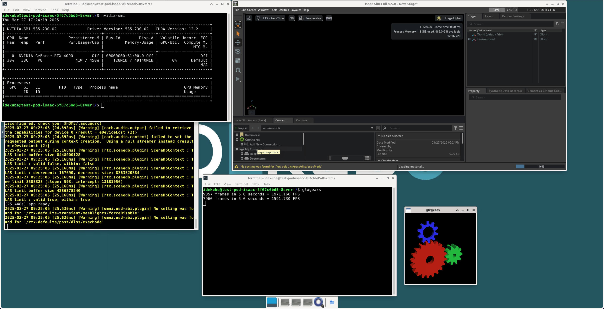

# idekube-container

<div style="text-align: center;">
    
</div>

The IDEKUBE project provides IDE containers for development work within Kubernetes clusters. This is a continuously updated collection of containers used in robotics, simulations, machine learning, and education (Shanghai Jiao Tong University Paris Elite Institute of Technology - SPEIT).

This is the **meta-repository** that owns the centralized build system. Image repos under `images/` remain independently versioned submodules but are driven from this repo's `docker-bake.hcl`.

## Repository Structure

### Build system (here)

| Path                            | Description                                          |
| ------------------------------- | ---------------------------------------------------- |
| `docker-bake.hcl`               | All bake targets, groups, dependency DAG, build args |
| `docker-bake.staging.hcl`       | Staging override (sets `STAGING_POSTFIX="-staging"`) |
| `docker-bake.production.hcl`    | Production override (GHA cache)                      |
| `Makefile`                      | Thin wrappers around `docker buildx bake` + tests    |
| `tests/`                        | pytest + Playwright suite, parametrized per branch   |
| `.github/workflows/publish.yml` | Staging CI for PRs, `main`, and manual dispatch      |
| `.github/workflows/publish-production.yml` | Production publish on releases or manual dispatch |
| `scripts/tag-stable.sh`         | Post-publish stable-tag aliasing helper              |
| `qemu-builder/`                 | QEMU/Ansible nested-VM build pipeline                |

### Submodules

| Submodule                      | Repository                                                                                        | Description                                                       |
| ------------------------------ | ------------------------------------------------------------------------------------------------- | ----------------------------------------------------------------- |
| [`artifacts/`](artifacts/)     | [idekube-container-artifacts](https://github.com/idekube-project/idekube-container-artifacts)     | Shared install scripts and common rootfs overlay                  |
| [`frontend/`](frontend/)       | [idekube-container-frontend](https://github.com/idekube-project/idekube-container-frontend)       | Vue.js landing page (built inside Docker via named context)       |
| [`healthcheck/`](healthcheck/) | [idekube-container-healthcheck](https://github.com/idekube-project/idekube-container-healthcheck) | Go health check server (compiled inside Docker via named context) |

### Image submodules

| Submodule                                        | GHCR repo                         | Variants                                       | Base                             |
| ------------------------------------------------ | --------------------------------- | ---------------------------------------------- | -------------------------------- |
| [`images/featured-base/`](images/featured-base/) | `idekube-container-featured-base` | `base`                                         | `ubuntu:24.04` / `ascendai/cann` |
| [`images/featured/`](images/featured/)           | `idekube-container-featured`      | `speit`, `speit-ai`, `dind`, `kathara`, `ros2` | `featured/base`                  |
| [`images/coder-base/`](images/coder-base/)       | `idekube-container-coder-base`    | `base`                                         | `ubuntu:24.04`                   |
| [`images/coder/`](images/coder/)                 | `idekube-container-coder`         | `conda`                                        | `coder/base`                     |
| [`images/jupyter-base/`](images/jupyter-base/)   | `idekube-container-jupyter-base`  | `base`                                         | `ubuntu:24.04` / `ascendai/cann` |
| [`images/jupyter/`](images/jupyter/)             | `idekube-container-jupyter`       | `speit-ai`, `speit-ascendai`                   | `jupyter/base`                   |
| [`images/agent-base/`](images/agent-base/)       | `idekube-container-agent-base`    | `base`                                         | `ubuntu:24.04`                   |
| [`images/agent/`](images/agent/)                 | `idekube-container-agent`         | `openclaw`, `hermes`                           | `agent/base`                     |

## Architecture

### Four flavors

- **`featured/`** — Full desktop with Coder + noVNC (TurboVNC + VirtualGL) + SSH. Variants: `base`, `speit`, `speit-ai`, `dind`, `kathara`, `ros2`
- **`coder/`** — Coder IDE only + SSH. Variants: `base`, `conda`
- **`jupyter/`** — JupyterLab only + SSH. Variants: `base`, `speit-ai`, `speit-ascendai`
- **`agent/`** — AI agent toolchain (Claude Code + opencode + document processing) + ttyd web terminal + SSH. Variants: `base`, `openclaw`, `hermes`

### Service endpoints

All services are reverse-proxied by Nginx on port 80:

| Endpoint    | Service                                               |
| ----------- | ----------------------------------------------------- |
| `/`         | Landing page (auto-detects available services)        |
| `/coder`    | Coder service                                         |
| `/jupyter`  | Jupyter service                                       |
| `/vnc`      | noVNC service                                         |
| `/agent`    | openclaw agent gateway                                |
| `/terminal` | ttyd web terminal                                     |
| `/ssh`      | Websocat-proxied SSH                                  |
| `/health`   | Health check endpoint (no auth, JSON, for k8s probes) |

### Build system at a glance

`docker buildx bake` reads `docker-bake.hcl` from the meta-repo root and:

1. Walks the dependency DAG via `target:` named contexts (no separate Python orchestrator).
2. Sets `--build-context artifacts=./artifacts`, `--build-context healthcheck-src=./healthcheck`, `--build-context frontend-src=./frontend` on every target so each Dockerfile only references its own image-repo tree.
3. For matrix-expanded dual-lineup images, generates `<name>-universal` and `<name>-ascend` variants with the right `BASE_IMAGE` and `platforms`.
4. Tags base repos as `<VERSION>[-ascend][-staging]` and application repos as `<variant>-<VERSION>[-ascend][-staging]`.

Bake schedules independent targets in parallel and resolves dependencies automatically.

### Dependency graph

```text
featured/base ──> featured/speit
              ──> featured/speit-ai
              ──> featured/dind ──> featured/kathara
              ──> featured/ros2

coder/base ──> coder/conda

jupyter/base ──> jupyter/speit-ai
             ──> jupyter/speit-ascendai

agent/base ──> agent/openclaw
           ──> agent/hermes
```

## Quick start

### Clone with submodules

```bash
git clone --recurse-submodules https://github.com/idekube-project/idekube-container.git
cd idekube-container
make prepare
```

### Build locally (single arch)

```bash
# Single target, host arch, loaded into local docker
make bake TARGET=featured-base-universal
make bake TARGET=agent-openclaw

# Inspect the bake plan as JSON
make discover GROUP=universal
```

### Multi-arch build (staging)

```bash
# Builds for both linux/amd64 and linux/arm64
make bake-staging GROUP=universal

# Or push to GHCR with -staging tag postfix
make push-staging GROUP=universal
```

### Multi-arch publish (production)

```bash
# After git tag v1.0.0:
VERSION=v1.0.0 make push-production GROUP=universal
VERSION=v1.0.0 make push-production GROUP=ascend

# Then alias base images as stable
make tag-stable BRANCH=featured/base VERSION=v1.0.0 LINEUP=universal
make tag-stable BRANCH=coder/base    VERSION=v1.0.0 LINEUP=universal
make tag-stable BRANCH=jupyter/base  VERSION=v1.0.0 LINEUP=universal
make tag-stable BRANCH=agent/base    VERSION=v1.0.0 LINEUP=universal
make tag-stable BRANCH=featured/base VERSION=v1.0.0 LINEUP=ascend
make tag-stable BRANCH=jupyter/base  VERSION=v1.0.0 LINEUP=ascend
```

In CI, GitHub releases and manual dispatches trigger the production workflow; PRs and pushes to `main` trigger the staging workflow.

### Run a pre-built image

```yaml
# docker-compose.yml
services:
  idekube_container:
    image: ghcr.io/idekube-project/idekube-container-featured-base:stable
    ports:
      - "3000:80"
    volumes:
      - idekube_volume:/home/idekube
    deploy:
      resources:
        reservations:
          devices:
            - driver: nvidia
              count: 1
              capabilities: ["gpu"]
    ipc: host

volumes:
  idekube_volume:
    driver: local
```

## Available image tags

Pre-built images are published on [GitHub Container Registry](https://github.com/orgs/idekube-project/packages?repo_name=idekube-container).

### Universal tags (base image: `ubuntu:24.04`)

| Image               | Repo                              | Variant tag          | Description                                                       |
| ------------------- | --------------------------------- | -------------------- | ----------------------------------------------------------------- |
| `featured-base`     | `idekube-container-featured-base` | `<version>`          | Full desktop (XFCE + noVNC) + Coder + SSH + Miniconda + VirtualGL |
| `featured-speit`    | `idekube-container-featured`      | `speit-<version>`    | + dev tools + Python scientific stack + Iverilog + Digital        |
| `featured-speit-ai` | `idekube-container-featured`      | `speit-ai-<version>` | + dev tools + PyTorch conda environment                           |
| `featured-dind`     | `idekube-container-featured`      | `dind-<version>`     | + Docker-in-Docker (dockerd, buildx, compose)                     |
| `featured-kathara`  | `idekube-container-featured`      | `kathara-<version>`  | featured-dind + Kathara network emulation                         |
| `featured-ros2`     | `idekube-container-featured`      | `ros2-<version>`     | + ROS 2 Jazzy desktop-full + Gazebo + MoveIt                      |
| `coder-base`        | `idekube-container-coder-base`    | `<version>`          | Coder IDE + SSH, minimal install                                  |
| `coder-conda`       | `idekube-container-coder`         | `conda-<version>`    | coder-base + Miniconda                                            |
| `jupyter-base`      | `idekube-container-jupyter-base`  | `<version>`          | JupyterLab + SSH + Miniconda                                      |
| `jupyter-speit-ai`  | `idekube-container-jupyter`       | `speit-ai-<version>` | + scientific stack + PyTorch conda environment                    |
| `agent-base`        | `idekube-container-agent-base`    | `<version>`          | Claude Code + opencode + document toolchain + ttyd + SSH          |
| `agent-openclaw`    | `idekube-container-agent`         | `openclaw-<version>` | + openclaw gateway at `/agent`                                    |
| `agent-hermes`      | `idekube-container-agent`         | `hermes-<version>`   | + Hermes Agent CLI + gateway                                      |

### Ascend tags (base image: `ascendai/cann`, ARM64 only)

Tags are suffixed with `-ascend`.

| Image                    | Repo                              | Variant tag                       | Description                          |
| ------------------------ | --------------------------------- | --------------------------------- | ------------------------------------ |
| `featured-base`          | `idekube-container-featured-base` | `<version>-ascend`                | Full desktop with Ascend NPU support |
| `featured-speit-ai`      | `idekube-container-featured`      | `speit-ai-<version>-ascend`       | Desktop + PyTorch with Ascend NPU    |
| `jupyter-base`           | `idekube-container-jupyter-base`  | `<version>-ascend`                | JupyterLab with Ascend NPU support   |
| `jupyter-speit-ai`       | `idekube-container-jupyter`       | `speit-ai-<version>-ascend`       | JupyterLab + PyTorch with Ascend NPU |
| `jupyter-speit-ascendai` | `idekube-container-jupyter`       | `speit-ascendai-<version>-ascend` | JupyterLab purpose-built for Ascend  |

## Runtime configuration

| Variable                  | Purpose                                      | Default     |
| ------------------------- | -------------------------------------------- | ----------- |
| `IDEKUBE_INIT_HOME`       | Initialize home from `/etc/skel`             | empty       |
| `IDEKUBE_PREFERED_SHELL`  | Path to preferred shell                      | `/bin/bash` |
| `IDEKUBE_USER_UID`        | Override container user UID                  | empty       |
| `IDEKUBE_AUTHORIZED_KEYS` | Base64-encoded SSH authorized keys           | empty       |
| `IDEKUBE_ACCESS_TOKEN`    | Nginx-level web auth token (excludes `/ssh`) | empty       |

### SSH proxy

```ssh-config
Host idekube
  User idekube
  ProxyCommand websocat --binary ws://$INGRESS_HOST$/ssh/
```

### Health check

Every container exposes `/health` (no auth) returning JSON for Kubernetes probes:

```json
{
  "status": "healthy",
  "branch": "featured/base",
  "entry": "/vnc/",
  "services": {
    "vnc":   { "port": 6081, "path": "/vnc/",  "healthy": true },
    "coder": { "port": 3000, "path": "/coder/", "healthy": true },
    "ssh":   { "port": 2222, "path": "/ssh",    "healthy": true }
  }
}
```

## Known issues

- For Kubernetes with Nginx Ingress Controller, the `nginx.org/websocket-services` annotation is required for the coder service.
- Chromium sandboxing and FUSE are not available in rootless mode. Use `privileged: true` to enable them.

## Acknowledgement

Many thanks to the authors of [docker-novnc](https://github.com/theasp/docker-novnc), [VirtualGL](https://github.com/VirtualGL/virtualgl), [TurboVNC](https://github.com/TurboVNC/turbovnc), and [Coder](https://github.com/coder/coder).
